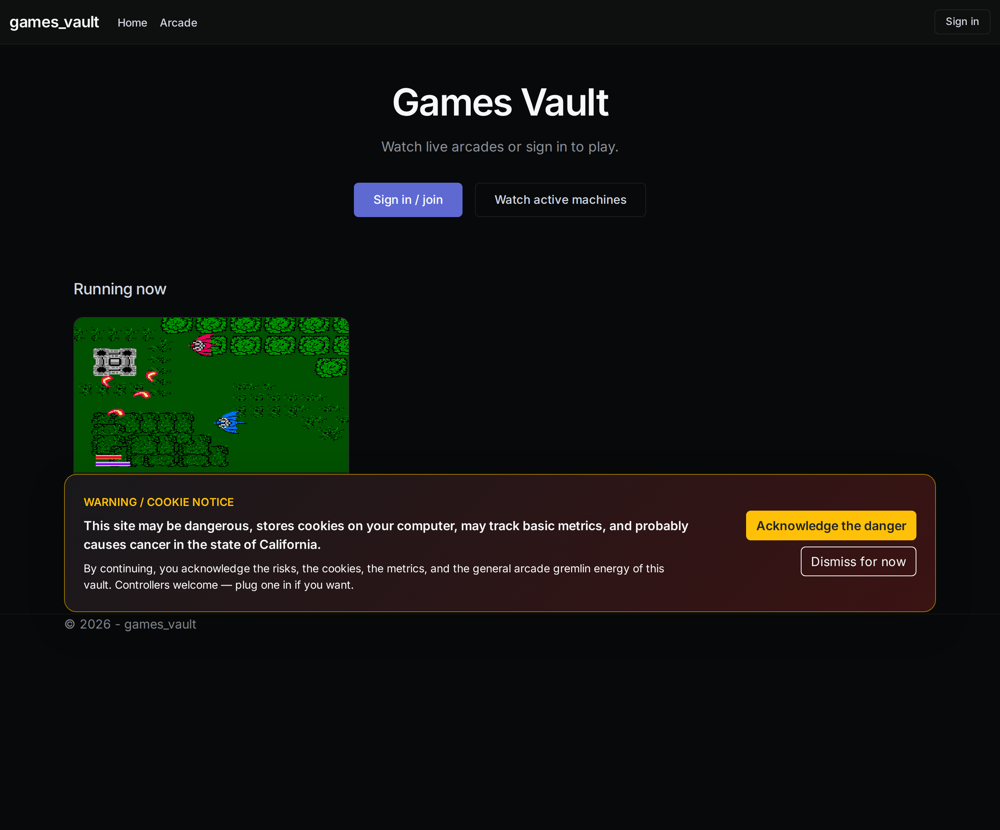
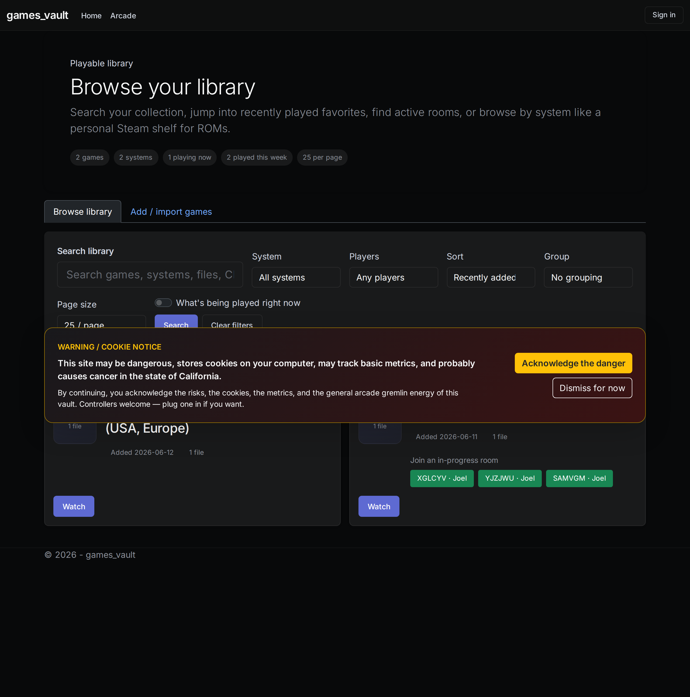

# Games Vault

[](LICENSE)
[](https://dotnet.microsoft.com/)
[](https://docker.com)

Personal game-library and arcade server. Pairs with [Nosebleed](https://github.com/longjoel/nosebleed) (libretro runtime) to browse, watch, and play games from the browser via WebRTC streaming.



---

## Quick start (Docker)

```bash
git clone https://github.com/longjoel/games-vault.git
cd games-vault

# Create .env with a database password
echo "POSTGRES_PASSWORD=$(openssl rand -base64 32)" > .env

# Start the app and database
docker compose up -d

# Open http://localhost:8080
```

The first run creates an admin profile. Register at `/Register` — the
first account is auto-promoted to admin.

---

## Build from source

### Prerequisites

- [.NET 10 SDK](https://dotnet.microsoft.com/download/dotnet/10.0)
- PostgreSQL 16+
- [Nosebleed](https://github.com/longjoel/nosebleed) binary (optional, for streaming)

### Steps

```bash
git clone https://github.com/longjoel/games-vault.git
cd games-vault

# Restore and build
dotnet restore
dotnet build

# Run (requires a running PostgreSQL instance)
ConnectionStrings__DefaultConnection="Host=localhost;Database=games_vault;Username=games_vault;Password=your_password" dotnet run

# Or point it at your DB
ASPNETCORE_URLS=http://0.0.0.0:8080 \
  ConnectionStrings__DefaultConnection="Host=localhost;..." \
  dotnet run
```

---

## Configuration

All settings use ASP.NET Core's `Environment` → `Configuration` binding.
Set them via environment variables with `__` as the section delimiter:

| Env var | Default | Description |
|---------|---------|-------------|
| `ConnectionStrings__DefaultConnection` | `Host=localhost;...` | PostgreSQL |
| `Library__RootPath` | `/srv/storage/games` | ROM directory |
| `Nosebleed__Enabled` | `false` | Enable streaming |
| `Nosebleed__BaseListenPort` | `8100` | WebRTC UDP base |
| `Nosebleed__MaxSessions` | `4` | Concurrent sessions |
| `PathBase` | *(none)* | Reverse proxy path |
| `DataProtection__KeyRingPath` | `/var/lib/games-vault/dp-keys` | DP key storage |

Full reference: [docs/configuration.md](docs/configuration.md)

---

## Architecture

```
Browser ──WebRTC──▶ Nosebleed ──libretro──▶ Emulator core
     │                                         │
     └── HTTPS ──▶ Games Vault ──▶ PostgreSQL   ROM files
```

- **Games Vault** — ASP.NET Core web app: library management, profiles, sessions arcade
- **Nosebleed** — libretro runtime: headless emulation with WebRTC video/audio/input streaming
- **PostgreSQL** — profiles, sessions, library metadata
- **coturn** (optional) — TURN relay for NAT traversal

See [docs/infrastructure/vps-networking.md](docs/infrastructure/vps-networking.md)
for the production deployment layout.



---

## User roles

| Role | Browse | Watch | Play | Chat | Save |
|------|--------|-------|------|------|------|
| Anonymous | ✓ | ✓ | — | — | — |
| Player | ✓ | ✓ | ✓ | ✓ | ✓ |
| Admin | ✓ | ✓ | ✓ | ✓ | ✓ |
| Guest (share link) | scoped | ✓ | scoped | ✓ | — |

---

## Offline (no Docker)

Games Vault runs as a systemd service on bare metal (the vault host) and
optionally in Docker on VPS/test instances. Deploy scripts live in
`scripts/` — see [docs/dev-prod-sync.md](docs/dev-prod-sync.md).

---

## License

[MIT](LICENSE)
